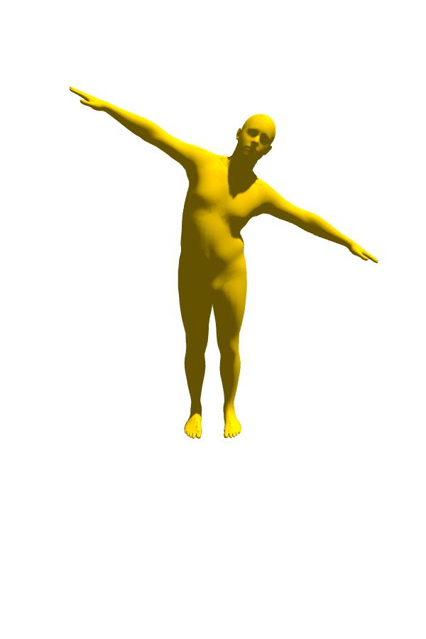
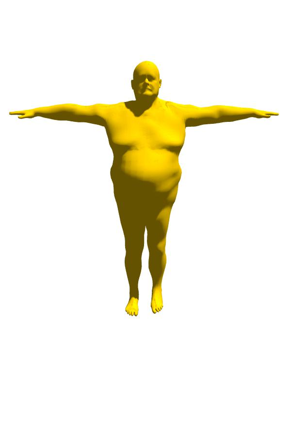

# PyRender for Human Mesh

### 需要包：

* smplx
* pyrender
* numpy
* trimesh
* opencv-python
* matplotlib
* torch

```bash
pip install -r requirements.txt
```

### 数据：

将数据下载，放入/classes/SMPL_models/和/classes/objs/

### Usage：

将classes文件夹放入项目root目录（运行的根目录），需要调用处用法：

```python

from classes.PyRenSmpl import PyRenSmpl
'''
参数说明：
        save_path: path to save output result
        mv_width: meshviewer width      float
        mv_height: meshviewer height    float
        bg_color: background color     float(4)
        device: device

        camera_dict: dict of camera
            ca_rotate:camera rotate angle   float(3)[80, 0, 30]
            ca_translate: camera translate position   float(3)[1.2, -2.3, 0.5]
  
        light_dict: dict of light
            li_rotate:light rotate angle   float(3)[50, 0, 10]
            li_translate: light translate position   float(3)[0, 0, 1]
            li_intens:light intensity                   float  3.0

        render_ground:need a ground?        bool
        gr_translate: ground translate      float(3)
        gr_extent:ground size               float(3)
        gr_color:ground color               float

        is_smpl:generate mesh from smpl?        bool
        is_gene_pic:generate picture?           bool
        is_gene_vid:generate video?             bool

        smpl_model: smpl smplx smplh
'''
#x:横着的轴，往右正方向 y:前后的轴，往前正方向 z:竖着的轴，向上正方向；旋转都是正方向时，正值为顺时针；注意负值旋转相当于360+该负值
#这些dict自己设置
camera_dict={
        'ca_rotate':[80, 0, 30],
        'ca_translate':[1.2, -2.3, 0.5],
    }
light_dict={
        'li_rotate':[50, 0, 10],
        'li_translate':[0, 0, 1],
        'li_intens': 3.0,
    }
input_dicts = {
        'device':device,
        'save_path':cfg.result_dir + f'/{args.mode}',
        'mv_width':600,
        'mv_height':900,
        'bg_color':[1.0, 1.0, 1.0, 1.0],
        'camera_dict':camera_dict,
        'light_dict':light_dict,
        'render_ground': True,
        'gr_translate':[0, 0, -1.02],
        'gr_extent':[20,12,0.1],
        'gr_color':0.9,
	'is_smpl':True,
	'is_gene_pic':False,
	'is_gene_vid':True,
	'smpl_model':'smpl',
    }
myrender = PyRenSmpl(input_dicts)
#调用
'''
        sequence: dict with 'poses' ('betas') ('gender') or 'vertices'
            pose: frmae_num * smplpara_num
	key:output file name
        his_frame:hisory frame number
'''
myrender.render_videos(
	sequence=sequence,
	key=key,
        his_frame=his_frame
)

```

### 大概：


> **想直接画一张smpl的简单示意图？**
>
> ```python
> from classes.PyRenSmpl import PyRenSmpl
>
> camera_dict={
>         'ca_rotate':[70, 0, 0],
>         'ca_translate':[0.0, -2.9, 0.5],
>     }
> light_dict={
>         'li_rotate':[10, 20, 10],
>         'li_translate':[2, -1.5, 3.3],
>         'li_intens': 7.0,
>     }
> input_dicts = {
>         'device':'cuda:4',
>         'smpl_model_path':'../SMPL_models/',
>         'save_path':'./outputs',
>         'mv_width':600,
>         'mv_height':900,
>         'bg_color':[1.0, 1.0, 1.0, 1.0],
>         'camera_dict':camera_dict,
>         'light_dict':light_dict,
>         'render_ground': False, #True,
>         'gr_translate':[0.3, 1, -2.02],
>         'gr_extent':[2,2,0.1],
>         'gr_color':0.9,
>     }
>   
> import torch
> betas_shape = [0] * 10
> #betas_shape[6] = 5
> #              0  1  2  3  4  5  6  7  8  9
> #betas_shape = [-3, 4, 1, 0, 5, -5, 2, 0, 5, 5]
> betas = torch.tensor(betas_shape, dtype=torch.float32)
> betas = betas.unsqueeze(0)
> #torch.zeros([1, 10], dtype=torch.float32)
>
> a = 14
> b = 18
> default_pose = torch.zeros([1, 69], dtype=torch.float32)#torch.zeros(1, 72)
> default_pose[:, [a*3, a*3+1, a*3+2]] = torch.tensor([-0.3, -0.5, 0.0])
> default_pose[:, [b*3, b*3+1, b*3+2]] = torch.tensor([-0.9, 0.3, 0.8])
>
> myrender = PyRenSmpl(input_dicts)
> myrender.render_naive_smpl(betas, default_pose)
> ```
>
> 大概：
>
> 

# PyRenSkele for Human Skeleton

**增加了骨架点的可视化！**

### Usage：

将classes文件夹放入项目root目录（运行的根目录），需要调用处用法：

```python
from classes.PyRenSkeleton import PyRenSkeleton
'''
参数说明：
        save_path: path to save output result
        img_size: matplotlib size      	float
        res_size: image size	    	int
        radius_point: draw point size   int
	radius_line: draw line size     int
	t_his:length of condition frame int
	elev:camera elevator angle	float
	azim:camera rotate angle 	float
	fps:frame rate 			int
'''
#这些dict自己设置
input_dicts = {
        'img_size':5.12,
	'res_size':(512, 512), 
        'save_path':'[PATH/TO/WHERE/TO/SAVE]',
        'radius_point':60,
	'radius_line':20, 
	't_his':[NUMBER OF HIS FRAME],
	'elev':1,
	'azim':20,
	'fps':30,
    }
myrender = PyRenSkeleton(
	input_dicts,
	color=color,
	draw_lines=draw_lines
)
#调用
'''
        p3d_draw: your skeleton sequence (T C 3)
'''
myrender.render_videos(
	p3d_draw=p3d_draw
)

```

### 大概：


